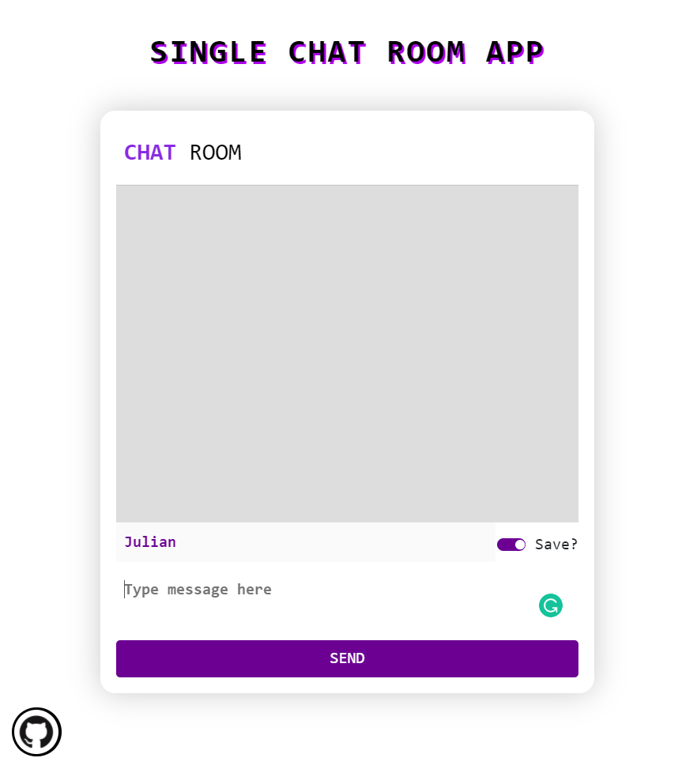

# SINGLE CHAT ROOM (with Socket.IO)

## The app uses Socket IO to work with chatting mechanism. 

- Enter your handle and start conversating
- Change handle whenever you like
- Unique handles for unique users (Authentication)
- Broadcasts 'XYZ is typing' when user types

 

 

 

